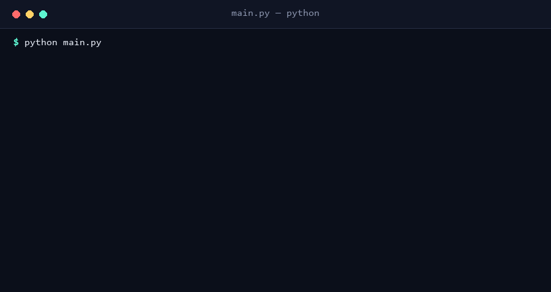

# Planejador de Treino Semanal

Aplicação de terminal para montar, consultar e remover uma rotina de treinos da semana, com interface colorida (via [rich](https://github.com/Textualize/rich)) e dados persistidos em JSON.



## Estrutura

```
treino-planner/
├── main.py                # ponto de entrada
├── planejador/
│   ├── core.py             # regras de negócio (sem I/O), fácil de testar
│   └── cli.py               # interface de terminal (rich)
├── tests/
│   └── test_core.py        # testes automatizados (pytest)
└── requirements.txt
```

A lógica (`core.py`) fica separada da interface (`cli.py`) de propósito: `PlanejadorTreino` não sabe nada sobre terminal, `input()` ou `print()` — só recebe e devolve dados. Isso é o que permite testar as regras sem precisar simular entrada de teclado.

## Como rodar

```bash
pip install -r requirements.txt
python main.py
```

## Rodar os testes

```bash
pytest
```

## Funcionalidades

- Adicionar ou editar o treino de um dia (musculatura + lista de exercícios com séries)
- Listar o planejamento completo da semana em tabelas
- Remover o treino de um dia específico, com confirmação
- Validação de dia da semana e de treino sem exercícios
- Persistência local em `dados_treino.json` (ignorado no git, é gerado no primeiro uso)
